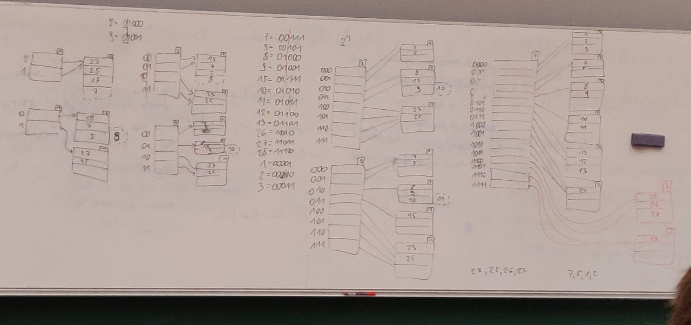

# 04-12-2018-PS

<!--TOC-->

## Aufgabe 14

Auf Richtigkeit pruefen: auf einen Bucket muessen immer $2^{\text{globale Tiefe} - \text{lokale Tiefe}}$ Pfeile zeigen. Die Anzahl Pfeile, die auf ein Bucket zeigt, muss eine Zweierpotenz sein.

## Aufgabe 15

Muss beim Zusammenfassen von Buckets beachten: die Prefixes muessen bis auf das letzte Zeichen dieselben sein. E.g kann man nicht zwei Buckets mit Pfeilen (`001`, `000`) und (`010`, `011`) zusammenfassen.

