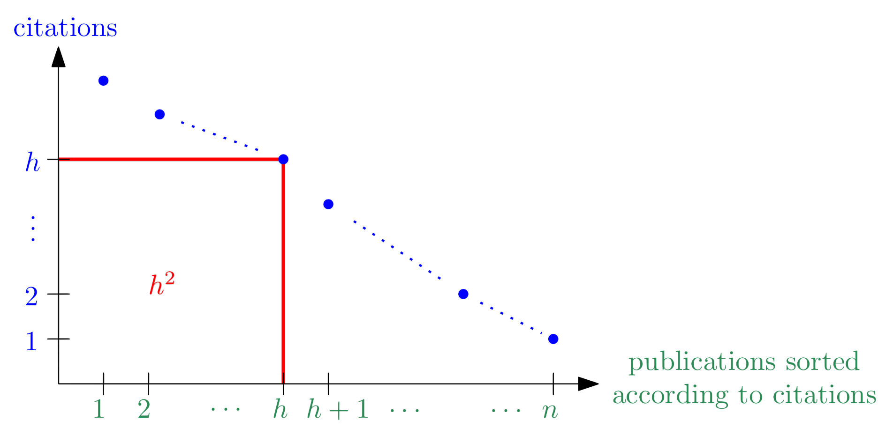

# 19-10-2018

<!--TOC-->

## Finding literature

Some review journals: 

* ACM Computing Reviews
* ACM Guide to Computing Literature
* Zentralblatt fuer Mathematik
* SIAM Review

They publish short summaries and critical evaluations of research in a particular area. Process takes a while - they might lag behind by years and only a small number of papers make their way to them.

*Bibliographies* are quite valuable: complete surveys on a particular subject and lots of references. 

The *Science Citation Index*: "Normal" citations refer to older papers. This thing reverses this: i.e. says "this paper is cited by..."; allowing you to search both towards the past and the future relative to the date of publication of some paper

* This can also be used to rate the importance of journals and papers

Today finding information is simple - Google (esp. [Google Scholar][2]). We also have [libraries][1]; e.g. [PubMed][3] is the main source for biomedical stuff

Finding a paper: three possibilities

1. [*Unibibliothek*][4]
2. Trying to find author's homepage on the web
3. Mailing author asking for the paper (address person according to their website - PhD students can be addressed as Mr./Mrs.)
4. Ask advisors, colleagues, ...

## Measuring quality

of journals, papers, scholars. As humans we like to assign a number representing quality in order to obtain a total order. We have various scores:

#### Journal Impact Factor

* Measures the average rate at which a journal is cited in scientific literature.
* How is this calculated? We define 
    * $S :=$ *number of papers published in the journal in the past two years* 
    * $R :=$ *number of publications referring to the journal in the past year* 
    * $\frac RS$ gives the JIF.
* There are criticisms: 
    * There has been obvious cheating
    * Single papers with lots of citations might result in massive changes in JIF
    * JIF differs between subjects because the relative number of citations that papers obtain during the first two years after publication varies
        * CS and math JIFs usually hover around 10 while good journals in the biosciences achiever around 30

#### h-Index and similar indices

* given by $h$ where, intuitively, $h$ is the side length of the largest square that fits under the curve given by the number of citations on the y-axis and the publications sorted in descending order on the x-axis

* **e-index** is the area on top of the square and bounded by the curve
* **g-index**, **r-index**, ... also exist

#### General problems with scores

* Rely on the basic assumption that more citations = better paper
    * Some publications are cited as examples of a *bad* paper
    * Small or new fields are disadvantaged
* Where do you count citations? Do books and conferences count?
* How do you treat self-citations?
* How do you automatically distinguish authors with the same name? (especially ones that work in the same field?)
    * *ORCID*: a persistent digital identifier for researchers
        * Idea works in theory, but useless right now - no enforcement etc.
* If value is attached to poor measures this may lead to poor practices
    * e.g. publishing multiple papers when one would suffice - more publications, more (self-)citations
* h-indices can and do differ even by database

A (sarcastic) text given by prof on how to boost h-index exemplifies problems with these indices: no longer about scientific advancement but about playing games.

## Giving oral presentations

#### Planning

Beginning to plan your presentation means you need to assess the setting:

* Who is your audience? Students (that might be in your peer group), scholars, politicans, even kids...
    * This obviously has a major impact on how you give your talk
    * What can you expect the audience to know?
* How much time do you have? You usually have to meet the goal time quite precisely
* What technical aids are available? Check this in advance.
    * Similarly, check the light conditions/structure of the hall to avoid visibility issues

Finally, planning the actual presentation figure out the following:

* What is your goal? This does **not** mean knowing the subject of your presentation
    * Advertising your company? Getting more research money? Popularizing your work? ...
    * What should your audience know or understand after your presentation?
    * Should the audience be able to perform some activity after the presentation?
    * You can communicate the goal, this gives motivation to listen
* From a scientific standpoint how valuable is your presentation? Do you know what you're talking about?
* Use some established structure - more on this below
* Technical aids are an augmentation but not a replacement
* Even a scientific presentation is some form of inter-human communication and thus its quality influenced by the way you present yourself and the material.

#### Structure

Stick to a more or less standard way. Know your talk (what to expect on the next 1 - 3 slides so you can keep transitions somewhat smooth).

The default template [stick to this *even with the presentation for this class*] looks somewhat like:

1. Welcome - title slide, introduce yourself/team members
2. Introduction - What's the topic of this presentation?
3. Outline - [skip this if your presentation is short] how is this presentation structured? How does the time plan look?
4. Main part -
    * Problem statement
    * Problem solution
    * [depending on presentation's goals] Correctness/implementaton/experiments
5. Conclusion - mention key points you want the audience to remember
6. Acknowledgments

#### Visual aids

Visual aids are very effective, but there are preferred formats. E.g. graphs work better than tables. 

* Use animation sparsely, is distracting
    * Fuck page transitions
        * Might be funny if a good one is shown once though
* Use color (consistently)
* Explain your graphics, they should not be self explanatory. Announce, display, explain, interpret and conclude the graphic.
    * Keep your graphics as complicated as neccessary but as simple as possible
    * It's better to omit excessive detail - leave out anything that you can't/won't explicitly explain

|Medium|Pro|Con|
| --- | --- | --- |
|Transparencies|spontaneous|sloppy and old fashioned|
|Blackboard|spontaneous, interactive|can't prepare, poor illustrations|
|Video Projector|perfect graphics and preparation|requires preparation, tech may fail|
[Comparison of presentation media]

Regarding "perfect preparation" part for video projectors: Can set up slides in a way such that you can throw in extra material/leave a few slides out as dictated by time constraints. Audience will hardly notice if you set up clickable links in between slides. But take care - presentation has to be understandable either way

[1]: https://dl.acm.org/dl.cfm
[2]: https://scholar.google.com
[3]: https://www.ncbi.nlm.nih.gov/pubmed/
[4]: https://www.ubs.sbg.ac.at/dbis/
