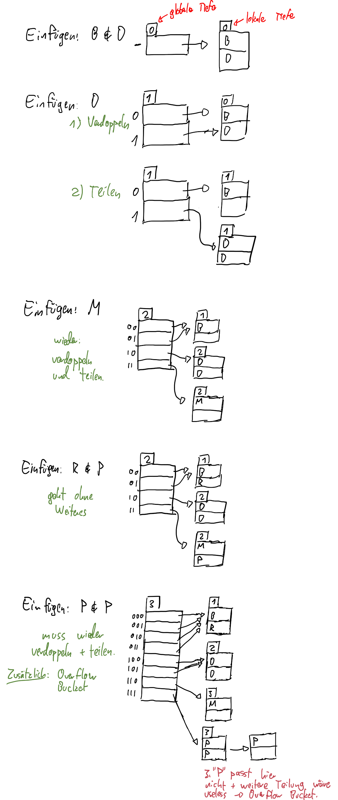
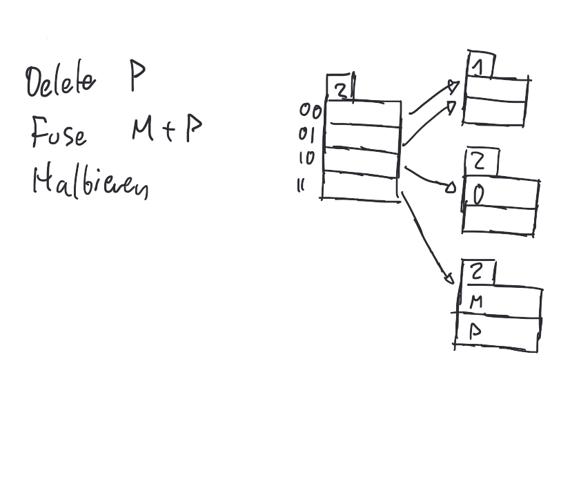

# 28-11-2018

<!--TOC-->

## Hashing Insertion Beispiel

Wir haben Buckets der Groesse 2 und folgende Daten (Folie ~76.)

| Schluessel | Hashwert |
| --- | --- |
Brighton|0010
Downtown|1010
Mianus|1100
Perryridge|1111
Redwood|0011

Wir sollen sequentiell Brighton, Downtown, Downtown, Mianus, Redwood, Perryridge, Perryridge, Perryridge einfuegen. Ist eingeteilt in Schritte immer wenn groessere Aktion noetig ist.

## Hashing Deletion

Haben folgenden Ausgangspunkt:

Sollen Brighton, Downtown, Redwood, Perryridge, Perryridge loeschen. Wieder eingeteilt wie oben.

Wir loeschen zunaechst:

## Hashing vs. B^+

Hashing eignet sich gut fuer Suchanfragen, schlecht fuer Bereichsanfragen

## Anfragen auf mehrere Suchschluessel

Koennen mehrere Indizes auf die jeweiligen Suchschluessel aufsetzen. Haben 3 Strategien, wenn wir zB `Balance=1000 AND Location='Perryridge'` suchen:

a) finde Tupel mit passender `Balance`, suche dann alle mit `'Perryridge'`
b) erst Perryridge suchen, dann nach Balance filtern
c) 2 Mengen bilden von Tupeln mit 1) passender Balance und 2) passender Location, dann Schnittmenge finden

Nur c) nutzt das Vorhandensein zweier Indices aus.

Gibt sonst Grid Files, Quad Trees, Bitmap Indizes - Bitmaps sind gut fuer e.g. Suche nach "weibliche Informatikerin mit blonden Haaren in Salzburg". Haette dann 4 Bitmaps (1dim boolean arrays, z.B. Bit 5 ist 1 bedeutet Tupel 5 ist weiblich) fuer jedes dieser Attribute. Muesste nur mit `UND` zsmfuegen

## Indices in der Praxis

Sollen uns Postgre installieren, um Kram auszuprobieren, damit die Sachen nicht so abstrakt bleiben. Postgre ist gut dokumentiert und entspricht SQL, also sinnvoll.

Verschiedene Beispiele, wie Indices geschaffen werden koennen, sind dann auf den Folien zu finden.
