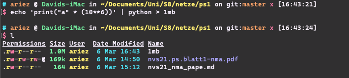
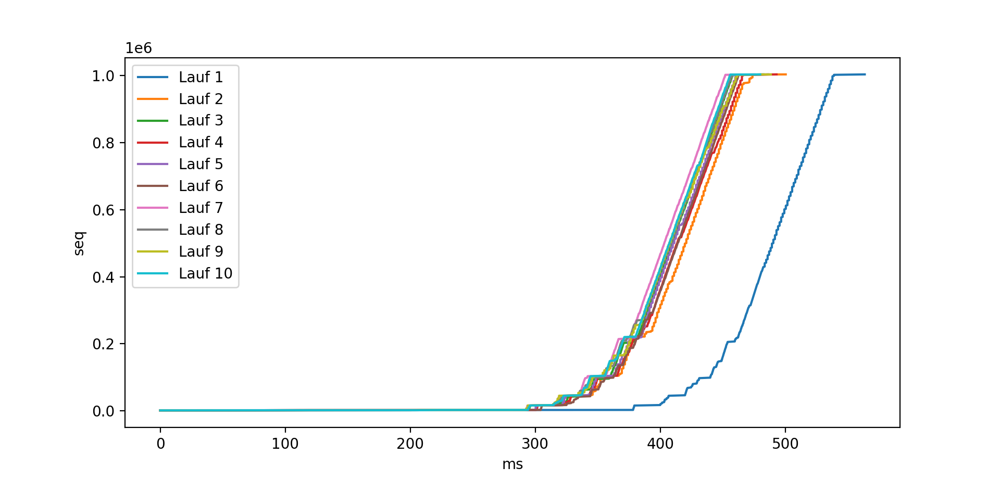
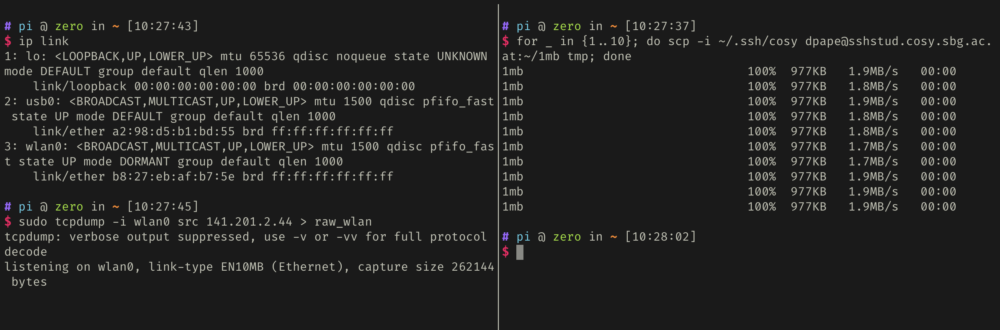
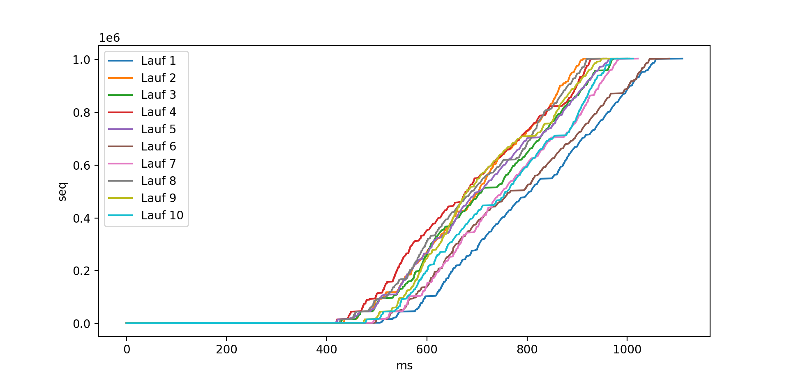
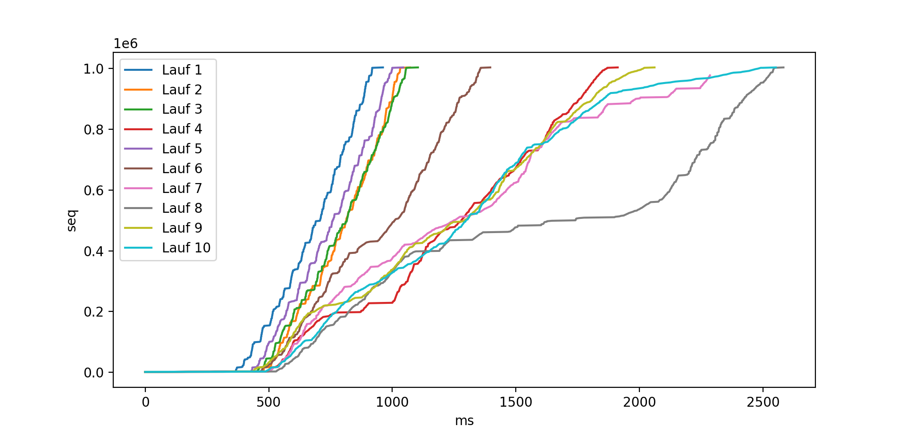

---
header-includes:
  - \hypersetup{colorlinks=true}
---

# NVS HÜ 1

Abgabe von David Pape, Matnr. 01634454

## Durchführung

Zum Erzeugen einer 1MB großen Datei wird Python verwendet:



Bemerkung: es wird davon ausgegangen, dass 1MB $=10^6$ Bytes. Für eine 1MiB ($=2^{20}$ Bytes) große Datei müsste man `2**20` in den Befehl einsetzen. macOS zeigt Dateigrößen auf der Festplatte in MB an, während z.B. `scp` Dateigrößen in MiB anzeigt, daher ist im obigen Screenshot eine Größe von `1.0M` angezeigt, während im Output von `scp` (unten) `977KB` steht.

Die Datei wird zunächst mittels `scp` auf den Cosy SSH Server übertragen. Dann wird die Übertragung in die andere Richtung gestartet und überwacht:


Der Output von `tcpdump` wird in die Datei `raw` gespeichert. Zum Kopieren wird wieder `scp` verwendet:


Da der rohe Output von `tcpdump` etwas unübersichtlich ist, wird die Datei `raw` anschließend mit `awk` etwas verdaulicher gemacht:

```bash
awk -F '[ ,]' 'BEGIN {print "TIMESTAMP\tSEQ"} \
{print $1 "\t" $10}' raw > cleaned
```


Um schlussendlich die Diagramme zu erstellen, werden Python und [matplotlib](https://matplotlib.org/) verwendet. Das Skript, welches die Plots erstellt (`plot.py`), ist im [Anhang](#Anhang) grob wiedergegeben und kommentiert.

Mit dem Befehl `python plot.py cleaned` wird folgendes Diagramm erzeugt:



Im Anschluss wird das Experiment auf einem mobilen Rechner im Wi-Fi wiederholt. Als solcher dient ein doch recht gemächlicher Raspberry Pi Zero W, was hoffentlich die deutlich geringere Übertragungsrate erklären kann.





Um eine schlechte Verbindung zu emulieren, entferne ich mich vom AP und bringe eine Wand zwischen die Geräte. Zusätzlich wird ein `sleep 1` in die `for`-Schleife mit dem `scp`-Aufruf eingebaut, damit mir genügend Zeit dazu bleibt.



## Diskussion

Die Ergebnisse spiegeln im Allgemeinen die Erwartungen wider. Mit Abstand am konsistentesten ist die Ethernet-Verbindung, wo nur der erste Lauf ca. 80ms länger gebraucht hat als der Rest. Scheinbar war im Anschluss die Verbindung "aufgewärmt", und vielleicht spielt auch die seek time der Festplatte vom `felstaube`-Rechner eine (kleine) Rolle.

Die stationäre Wi-Fi Verbindung hat mit durchschnittlich ca. 1000ms doppelt so lange gebraucht wie die Ethernet-Verbindung und zeigt auch eine deutlich größere Varianz auf. Dies verblasst aber angesichts der simulierten schlechten Verbindung, welche bis zu 2500ms gebraucht hat und ein stark variierendes Wachstum der `seq`-Nummern aufweist.

Beim Diagramm von Letzterem wird eventuell auch ersichtlich, dass der Aufbau von Entfernung zwischen den Geräten nicht der zuverlässigste Weg ist, um eine schwächere Verbindug zu simulieren. Zwar ist der generelle Trend wie erwartet (der Download dauert länger), allerdings gibt es bemerkenswerte Outlier. 

Beispielsweise wurde Durchlauf 5 ähnlich schnell wie Durchlauf 1 abgeschlossen, obwohl sowohl der Lauf davor als auch der danach wesentlich langsamer waren. Auch ist der zehnte Durchlauf gleich schnell wie der achte Durchlauf abgeschlossen. Dabei habe ich versucht, die Distanz linear mit der Durchlaufsnummer zu erhöhen, und beim 5. Durchlauf sollte bereits eine Wand zwischen den Geräten gewesen sein.

\pagebreak

# Anhang {#Anhang}

```python
timestamps = []
seqs = []

with open(sys.argv[1]) as f:
    prev_seq = 10e20
    for line in f.readlines()[1:]: # ignore header
        split = line.strip().split("\t")
        
        if len(split) == 2:
            # parse seq and timestamp
            seq = int(split[1].split(":")[0])
            timestamp = parse(split[0]).timestamp()
            
            # the file contains a series of connections.
            # seq < prev_seq indicates that we finished parsing 
            # a connection, so we plot it and prepare for 
            # parsing the next
            if seq < prev_seq:
                if len(timestamps) > 500: # ignore noise
                    plt.plot(timestamps, seqs)
                timestamps = []
                seqs = []
                initial_timestamp = timestamp
                
            prev_seq = seq
            timestamps.append(timestamp - initial_timestamp)
            seqs.append(seq)
```
