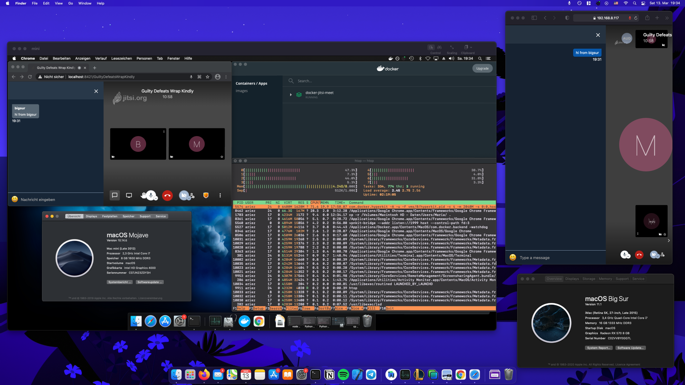

---
header-includes:
  - \hypersetup{colorlinks=true}
---

# NVS PS HÜ 2: Jitsi Meet

Abgabe von David Pape (01634454)

## Umgebung

Ich habe einen ehemalig ausrangierten 2012 Mac Mini als Heimserver umfunktioniert. Dieser hostet u.A. bereits einen Musik-Player und einen Fileserver, entsprechend war es naheliegend, ihn dann auch statt einer VM als Host für Jitsi Meet zu nutzen. Der Mac Mini hängt headless an meinem lokalen Netzwerk und wird über das Screen Sharing-Feature von macOS und/oder SSH bedient. 

Der Vollständigkeit halber sei hier noch wiedergegeben, wie eine Debian-VM z.B. mit [QEMU](https://www.qemu.org/) aufzusetzen wäre:

```bash
qemu-img create -f qcow2 debian.qcow2 32G
curl -O https://cdimage.debian.org/debian-cd/current/amd64/[...]
qemu-system-x86_64 \
  -m 4G \
  -vga virtio \
  -display default,show-cursor=on \
  -usb \
  -device usb-tablet \
  -machine type=q35,accel=hvf \
  -smp 2 \
  -cdrom debian-10.8.0-amd64-netinst.iso \
  -drive file=debian.qcow2,if=virtio \
  -cpu host \

```

## Installation

Um die ~~Faulheit~~ Zeiteffizienz zu maximieren, habe ich mich für die [Docker-Version von Jitsi](https://jitsi.github.io/handbook/docs/devops-guide/devops-guide-docker) entschieden. Unter der Annahme, dass Docker bereits installiert ist, sollten theoretisch nur folgende Befehle vonnöten sein:

```bash
git clone https://github.com/jitsi/docker-jitsi-meet
cd docker-jitsi-meet
cp env.example .env
./gen-passwords.sh
mkdir -p ~/.jitsi-meet-cfg/{web/letsencrypt,transcripts, \
  prosody/config,prosody/prosody-plugins-custom,jicofo,jvb, \
  jigasi,jibri}
```

\pagebreak

An dieser Stelle muss noch die Datei `.env` konfiguriert werden. Ich habe folgende Einträge angepasst:


```
# Directory where all configuration will be stored
CONFIG=~/.jitsi-meet-cfg

# Exposed HTTP port
HTTP_PORT=8420

# Exposed HTTPS port
HTTPS_PORT=8421

# System time zone
TZ="Europe/Amsterdam"

# Public URL for the web service (required)
PUBLIC_URL=https://192.168.8.117:8421

# IP address of the Docker host
DOCKER_HOST_ADDRESS=192.168.8.117
```

Schlussendlich startet man Jitsi mit dem Kommando `docker-compose up -d`.


\pagebreak

## Testlauf

Leider war damit tatsächlich nur *theoretisch* der Setup-Prozess abgeschlossen. In der Praxis lieferte das Docker-Image bei einem Testlauf nur einen Connection Error.


Eine Recherche lieferte den [Tipp](https://community.jitsi.org/t/you-have-been-disconnected-on-fresh-docker-installation/89121), ein älteres Release des Docker-Images zu verwenden. Nach einem `git checkout stable-5076` mit anschließendem Wiederholen der Konfiguration funktionierte Jitsi dann schlussendlich ohne Probleme.



