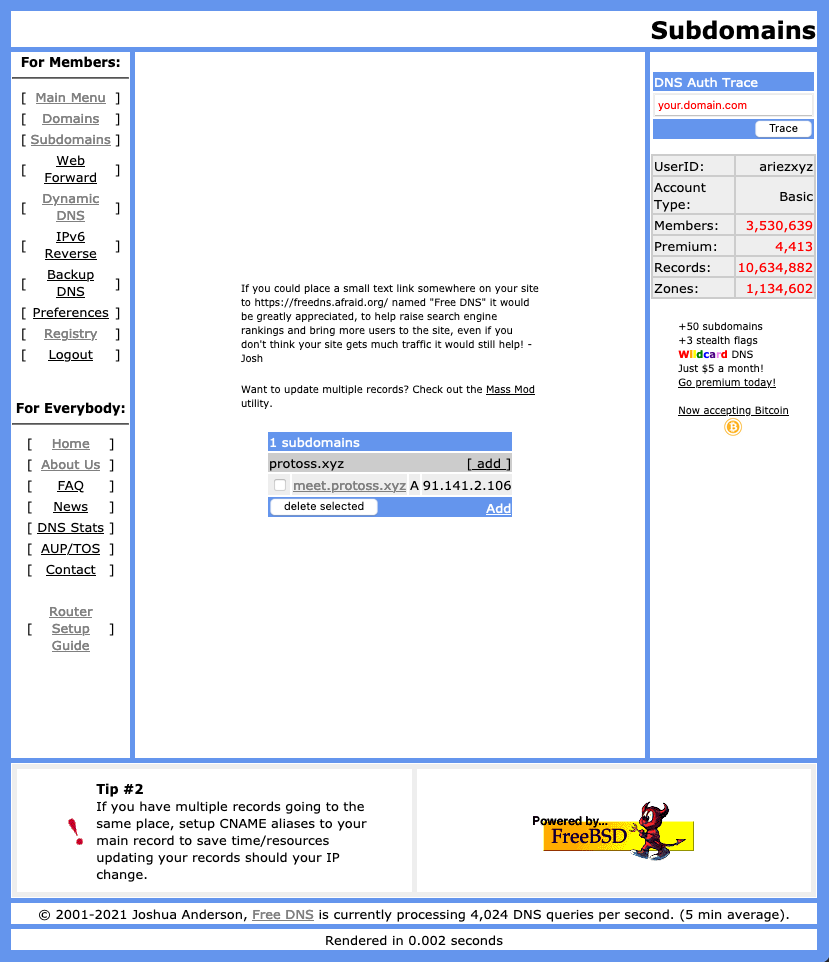
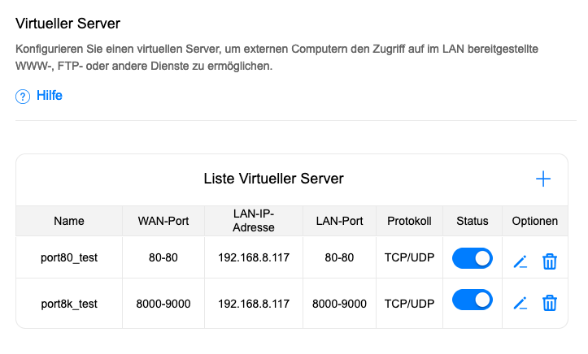
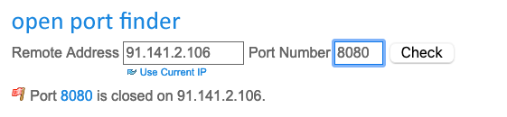
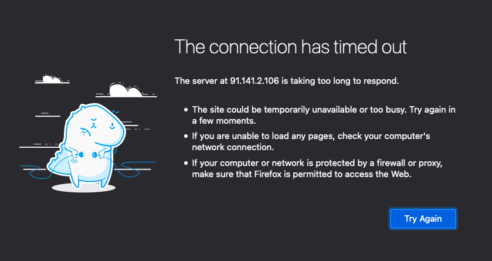
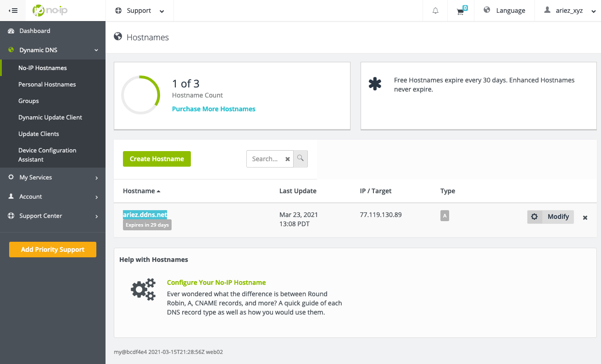
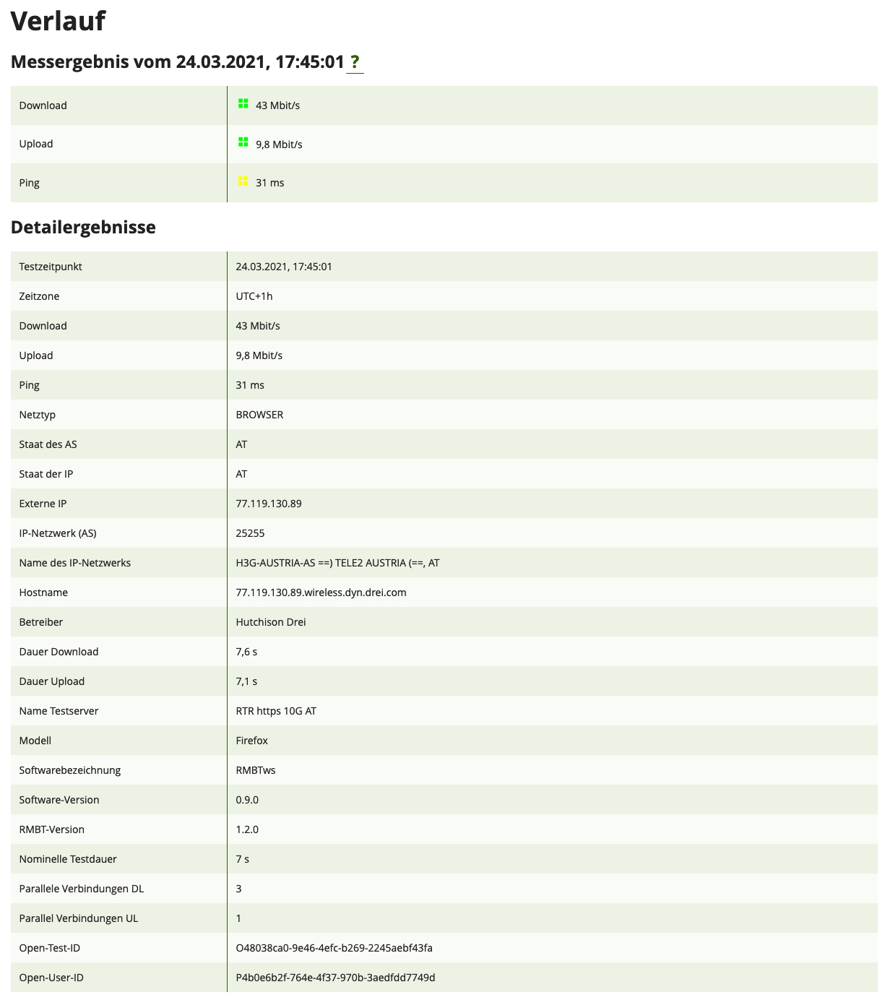

---
header-includes:
  - \hypersetup{colorlinks=true}
---

# NVS PS HÜ 3: DDNS

Abgabe von David Pape (01634454)

## DDNS Theorie

DDNS steht für "dynamic domain name system", wobei das "dynamic" sich darauf bezieht, dass domain names auf eine dynamische IP-Adresse aufgelöst werden. Dies setzt natürlich voraus, dass der DDNS-Server Bescheid weiß, wenn sich die dynamische IP ändert. Der Server muss also regelmäßig Updates bekommen. 

Je nach Anbieter ist dies unterschiedlich umgesetzt; kommerzielle Anbieter wie [no-ip](https://www.noip.com/) bieten gewöhnlicherweise Helfer-Programme an, um das Problem möglichst einfach zu lösen, während [freedns.afraid.org](https://freedns.afraid.org/) eine simple API bietet. Dort bekommt jede Domain einen Token und dann reicht es aus, vom Zielrechner aus eine `GET`-Request an den entsprechenden API-Endpunkt zu senden:

```bash
$ curl https://sync.afraid.org/u/CyTXMbtq5cPnLjEg5vKHTPDE/
Updated demo.freshdns.com from 107.170.238.X to 50.23.197.94 
```

Die IP-Adresse wird dann automatisch auf jene gesetzt, welche die Request gesendet hat. Diese Methode lässt es einem selber offen, wie man den DNS-Server updated, und ist dadurch machtvoller als Helfer-Programme. Beispielsweise können Hooks auf dem OS-Level genutzt werden, um bei einer Änderung an dem Netzwerkinterface sofort ein Update an afraid.org zu senden. Das Helfer-Programm von no-ip fragt währenddessen nur in fixen Zeitintervallen von minimal 5 Minuten die aktuelle IP-Adresse ab, was also zu Unterbrecheungen von bis zu 5 Minuten führen kann.

Der Vorteil von DDNS gegenüber DNS ist einfach: es wird ermöglicht, eine domain zu nutzen, ohne eine statische IP zu benötigen, welche in der Regel mit Zusatzkosten verbunden ist. Heimnutzer können so vom Internet aus auf ihr Heimnetzwerk zugreifen, ohne eine schwer merkbare und sich ständig ändernde IP-Adresse im Kopf behalten zu müssen.

## DDNS für Jitsi Meet

Ich habe als DDNS-Anbieter [freedns.afraid.org](freedns.afraid.org) gewählt. Neben erwähnter API bietet der Service extrem viele Domains, unter denen man sich kostenlos eine Subdomain wählen kann. Ich habe die Domain `meet.protoss.xyz` gewählt und ließ sie auf meine aktuelle IP zeigen.



Anschließend habe ich versucht, das Port Forwarding an meinem Router einzurichten. Leider muss ich vorwegnehmen, dass es bei einem Versuch blieb - es war mir nicht möglich, eine Konstellation der Einstellungen zu finden, die zu dem gewünschten Ergebnis geführt hätte. Ich vermute, dass es an einem schlecht implementierten Admin-Panel und/oder der Tatsache, dass es sich um einen LTE-Router handelt, liegt.

Zunächst habe ich einfache Forwards eingerichtet und diese mit einem Portscanner sowie einfach Firefox geprüft.







Leider blieb der Erfolg damit aus.

Zu Testzwecken habe ich dann einen simplen HTTP-Server aufgesetzt, der nur eine statische Hello-World-Seite liefert. Damit wollte ich ausschließen, dass es an einem Problem mit dem Jitsi Docker-Container lag. Leider konnte ich auch diesen Server nicht erreichen.

Weitere Optionen, die ich dann durchprobiert hatte, waren [DMZ](https://en.wikipedia.org/wiki/DMZ_(computing)), Abschalten der Firewall, eine andere Domain, andere Portfreigaben, mehrfache Neustarte unterschiedlichster Geräte sowie physische Gewalt, aber das Problem schien sich nicht um diese Maßnahmen zu kümmern.

\pagebreak

Das einzige Lebenszeichen kam schlussendlich, als ich es unter wachsender Verzweiflung nochmal mit no-ip versucht hatte, wofür mein Router extra eine Option in den Einstellungen anbietet.



Dadurch war es mir möglich, das Admin-Panel meines Routers öffentlich unter der von no-ip bereitgestellten Domain zu erreichen. Ob das nun eher als Erfolg oder als Misserfolg zu verbuchen ist, sei dahingestellt. Auf jeden Fall war es immer noch nicht möglich, die weitergeleiteten Ports zu erreichen.

Recherche im Internet zeigte, dass andere Leute [das gleiche Problem](https://community.magenta.at/topic/6016-huawei-b535-232-externer-zugang-port-forwarding/) mit diesem Router hatten, und lieferte außerdem Hinweise, dass DDNS mit einem LTE-Router wie meinem generell problematisch sein kann. Möglich wäre auch, dass mein ISP die Ports einfach blockiert. An dieser Stelle habe ich das Unterfangen dann für unmöglich erklären müssen und aufgegeben.

\pagebreak

## Anhang

Der Zeitaufwand betrug insgesamt ca. 7 Stunden.

Der RTR Netztest liefert Werte, die fast exakt den beworbenen 40/10Mbit entsprechen.


